# 🎬 Netflix Clone

A fully functional Netflix Clone built with Django, offering a seamless user experience for browsing and watching movies.

## 🚀 Features
- 🔐 **User Authentication** - Sign up, log in, and log out securely.
- 🎥 **Browse & Search Movies** - Explore a vast collection of movies and filter results instantly.
- ▶️ **Watch Movie Trailers** - Click on any movie to view its details and watch trailers.
- 📌 **Detailed Movie Pages** - View descriptions, release years, genres, and more.
- 📱 **Responsive Design** - Enjoy a smooth experience on any device.

## 🛠 Installation
1. **Clone the repository:**
   ```sh
   git clone https://github.com/EMMMABK/NetflixClone.git
   cd netflix-clone
   ```
2. **Create & activate a virtual environment:**
   ```sh
   python -m venv venv
   source venv/bin/activate  # On Windows use `venv\Scripts\activate`
   ```
3. **Install dependencies:**
   ```sh
   pip install -r requirements.txt
   ```
4. **Apply migrations:**
   ```sh
   python manage.py migrate
   ```
5. **Create a superuser** (optional for admin panel access):
   ```sh
   python manage.py createsuperuser
   ```
6. **Run the development server:**
   ```sh
   python manage.py runserver
   ```
7. **Open your browser** and go to `http://127.0.0.1:8000/`

## 🌐 API Endpoints

| Endpoint         | Method  | Description                     |
|-----------------|---------|---------------------------------|
| `/`             | `GET`   | Home page                       |
| `/signup/`      | `GET, POST` | User registration             |
| `/login/`       | `GET, POST` | User login                     |
| `/logout/`      | `GET`   | User logout                     |
| `/movie/`       | `GET`   | List of all available movies    |
| `/movie/<uuid>/` | `GET`   | Movie details and trailer      |

## 🎭 Usage
- **Create an account** or **log in** to access the movie collection.
- **Use the search bar** to quickly find movies.
- **Click on a movie** to see its details and watch the trailer.
- **Enjoy a responsive UI** designed for a smooth browsing experience.

## 📸 Screenshots
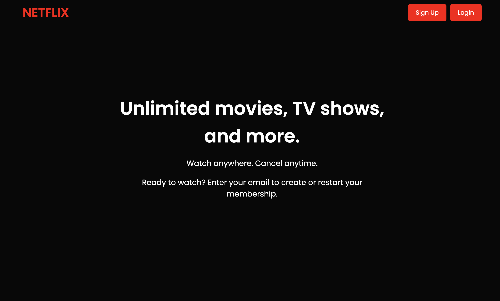
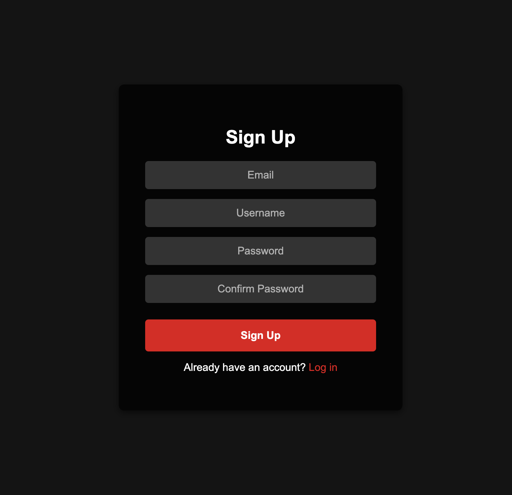
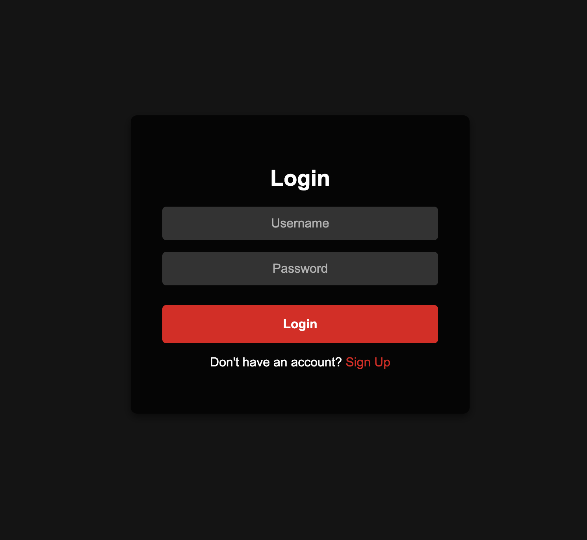
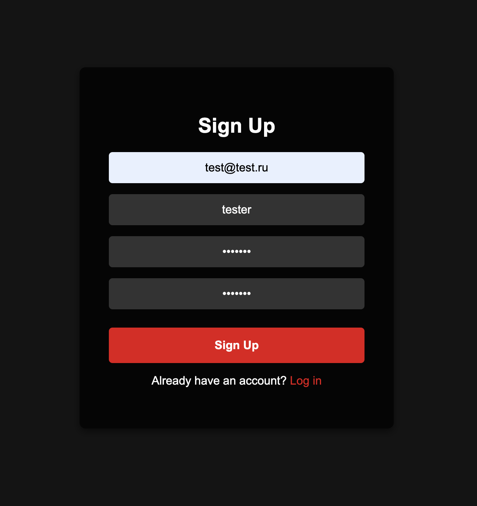
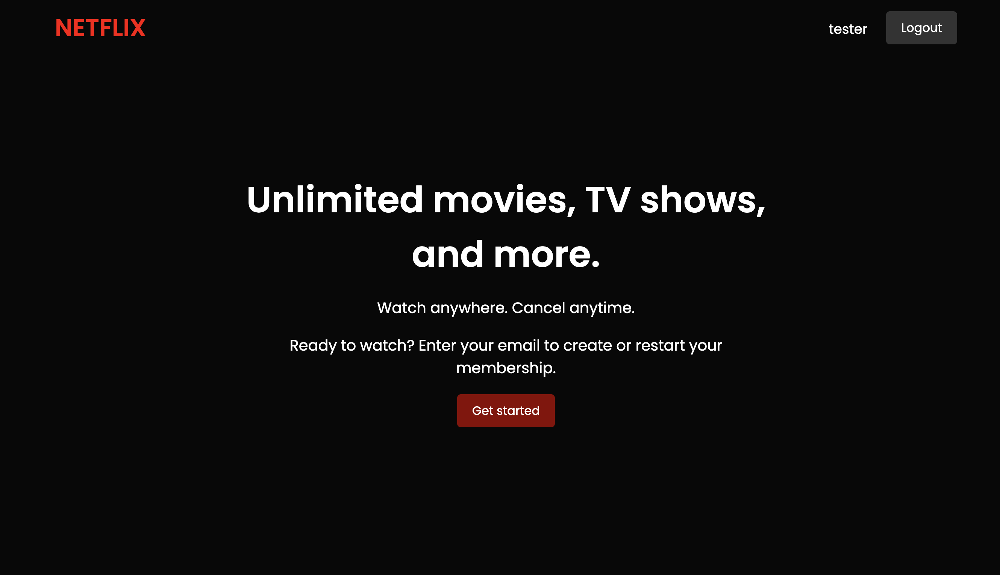
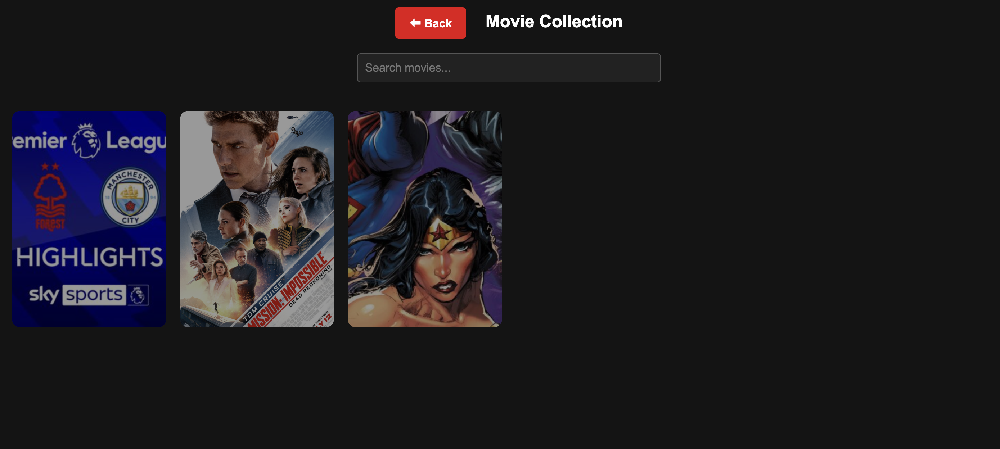
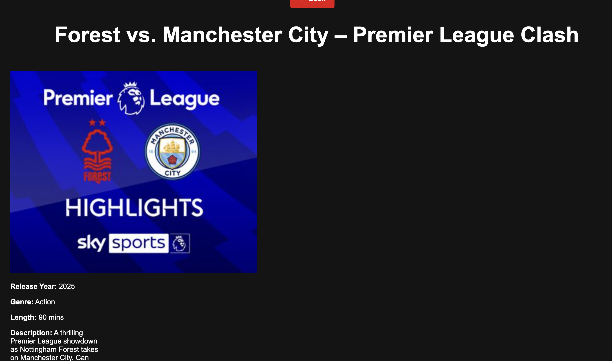
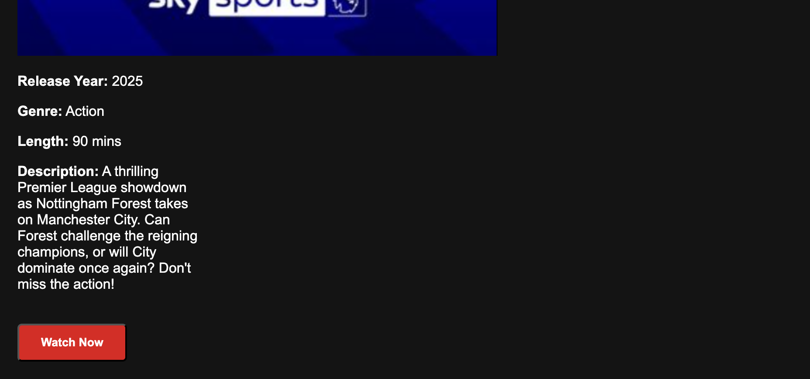
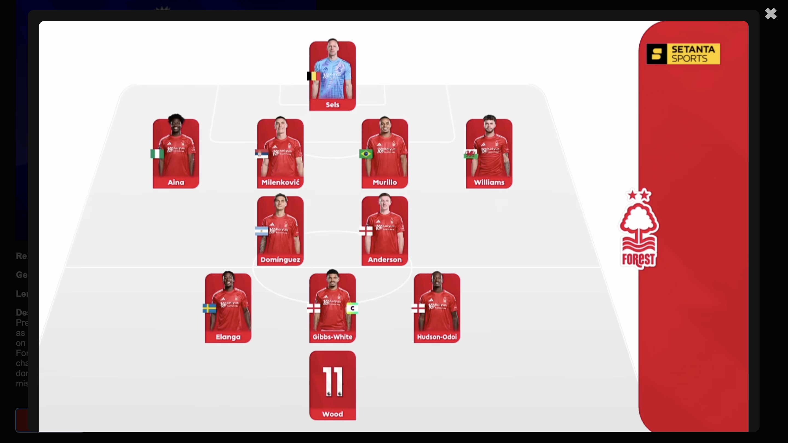
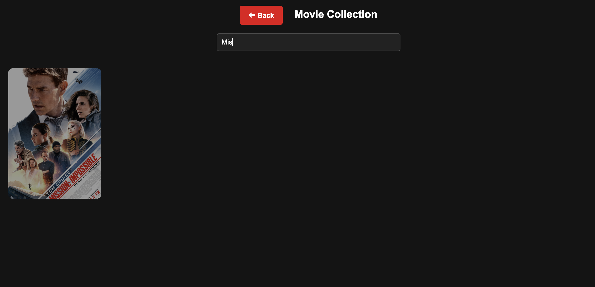
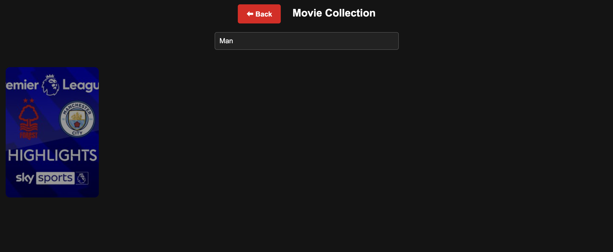

## 🛠 Technologies Used
- **Django** - Backend web framework.
- **SQLite** - Database for development.
- **HTML, CSS, JavaScript** - Frontend technologies for a responsive UI.

## 📜 License
This project is licensed under the **MIT License**.

